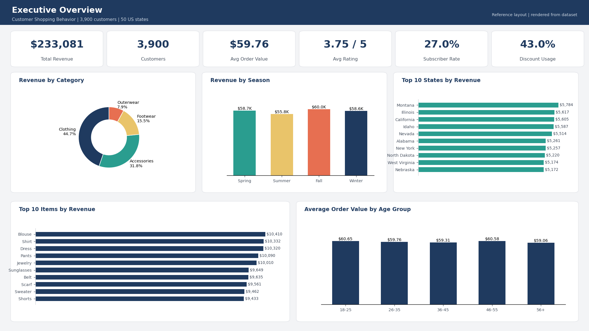
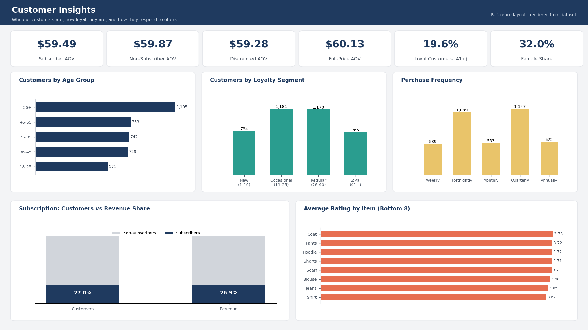

# Customer Shopping Behavior Analytics | Power BI


An end-to-end business intelligence project that turns raw retail customer data into an interactive Power BI dashboard, covering sales performance, customer segmentation, loyalty, subscription behaviour, and discount effectiveness.

<p align="center">
  
</p>

> **Note:** the images in this repository are reference layouts rendered from the dataset. Replace them with screenshots of the finished `.pbix` (see the [build guide](docs/dashboard_build_guide.md)).

---

## Table of Contents
1. [Business Problem](#business-problem)
2. [Dataset](#dataset)
3. [Approach](#approach)
4. [Dashboard Pages](#dashboard-pages)
5. [Key Insights](#key-insights)
6. [Recommendations](#recommendations)
7. [Repository Structure](#repository-structure)
8. [How to Reproduce](#how-to-reproduce)
9. [Limitations](#limitations)
10. [Author](#author)

---

## Business Problem

A specialty retailer wants to understand **who its customers are, what they buy, and which levers (discounts, subscriptions, shipping, seasonality) actually influence spending.** The dashboard answers:

- Which categories, products, and states drive revenue?
- How does spending vary by season, age, and gender?
- Do subscribers and discount users spend more than other customers?
- How loyal are customers, and how satisfied are they?

## Dataset

| Attribute | Detail |
|---|---|
| File | `data/raw/customer_shopping_behavior.csv` |
| Grain | One row per customer |
| Size | 3,900 rows x 18 columns |
| Coverage | 50 US states, 25 products, 4 categories |
| Quality | 37 missing review ratings (0.95%), otherwise complete |

Full column definitions and the data quality log are in the [data dictionary](docs/data_dictionary.md).

## Approach

| Stage | What was done | Where |
|---|---|---|
| 1. Profiling | Checked types, nulls, duplicates, distributions | `scripts/data_preparation.py` |
| 2. Cleaning | Removed a redundant column, standardised inconsistent frequency labels, kept missing ratings blank rather than imputing | Power Query + Python |
| 3. Feature engineering | Age Group, Purchase Tier, Loyalty Segment, Rating Band, Frequency Group, plus sort keys | `powerbi/power_query/transform.m` |
| 4. Modelling | Single fact table + dedicated measures table | [data model](docs/data_model.md) |
| 5. DAX | KPIs, subscription and discount analysis, ranking, dynamic titles, conditional formatting | `powerbi/dax/measures.dax` |
| 6. Visualisation | Custom theme, consistent layout, synced slicers | `powerbi/theme/` |
| 7. Insight | Findings and recommendations | [insights](docs/insights_and_recommendations.md) |

## Dashboard Pages

### 1. Executive Overview
Six headline KPIs (revenue, customers, average order value, rating, subscriber rate, discount usage), revenue by category, season, and state, top products, and average order value by age group.

### 2. Customer Insights
Subscriber vs non-subscriber and discounted vs full-price spend, customer mix by age and loyalty, purchase frequency, and the lowest-rated products.

<p align="center">
  
</p>

### 3. Operations (optional)
Shipping type, payment method, size and colour analysis.

## Key Insights

| Metric | Result |
|---|---|
| Total revenue | **$233,081** across 3,900 customers |
| Average order value | **$59.76** |
| Top categories | Clothing **44.7%**, Accessories **31.8%** of revenue |
| Best season | **Fall**, $60.0K and the highest AOV ($61.56) |
| Discount users | **43%** of customers, but AOV is *lower* ($59.28 vs $60.13) |
| Subscribers | **27%** of customers, with no AOV lift ($59.49 vs $59.87) |
| Largest age segment | **56+** (28.3% of customers) |
| Lowest-rated top sellers | Shirt (3.62), Blouse (3.68) |

Full analysis: [`docs/insights_and_recommendations.md`](docs/insights_and_recommendations.md)

## Recommendations

1. **Investigate quality and sizing** on Shirts, Jeans, and Blouses, which are the lowest rated among high-volume products.
2. **Redesign subscription benefits**, since subscribers currently show no spend uplift.
3. **Replace blanket discounts with targeted offers**, as discounts do not raise basket size.
4. **Front-load Fall inventory and campaigns** and add Summer promotions.
5. **Grow Outerwear** through bundling, given its lowest share and AOV.

## Repository Structure

```
customer-shopping-behavior-powerbi/
├── README.md
├── LICENSE
├── requirements.txt
├── .gitignore
├── data/
│   ├── raw/                     # Original, untouched CSV
│   └── processed/               # Cleaned + feature-engineered CSV
├── scripts/
│   ├── data_preparation.py      # Validation, cleaning, feature engineering
│   └── generate_dashboard_preview.py
├── powerbi/
│   ├── power_query/transform.m  # Power Query (M) transformation
│   ├── dax/measures.dax         # All DAX measures, organised by theme
│   ├── theme/corporate_theme.json
│   └── report/                  # Place Customer_Shopping_Behavior.pbix here
├── docs/
│   ├── data_dictionary.md
│   ├── data_model.md
│   ├── insights_and_recommendations.md
│   └── dashboard_build_guide.md
└── images/                      # Dashboard screenshots
```

## How to Reproduce

**Option A | Power BI only**
1. Clone the repository.
2. Follow the [build guide](docs/dashboard_build_guide.md): load the CSV, paste `transform.m`, add the DAX measures, apply the theme.

**Option B | Python data prep**
```bash
pip install -r requirements.txt
python scripts/data_preparation.py          # writes data/processed/*.csv
python scripts/generate_dashboard_preview.py
```

**Requirements:** Power BI Desktop (latest), Python 3.9+ (optional).

## Limitations

- The dataset has **no transaction dates**, so trend and retention analysis are not possible; `Season` is the only time proxy.
- There are **no cost, margin, or discount-amount fields**, so profitability and discount ROI cannot be measured.
- Segment differences are small (typically within $1 to $3 of average order value), so recommendations should be validated with A/B testing.

## Author

**[Your Name]**
[LinkedIn](https://www.linkedin.com/) | [GitHub](https://github.com/) | [Email](mailto:you@example.com)

Licensed under the [MIT License](LICENSE).
